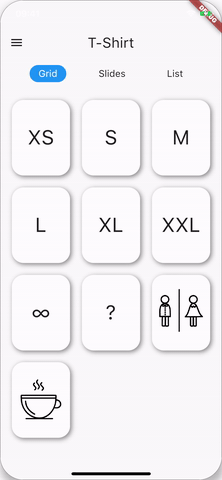
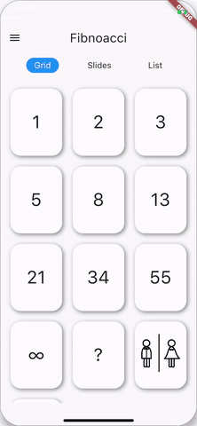
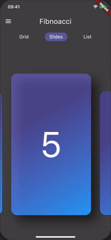
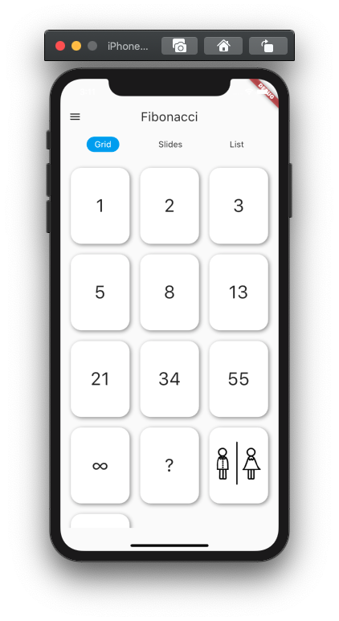
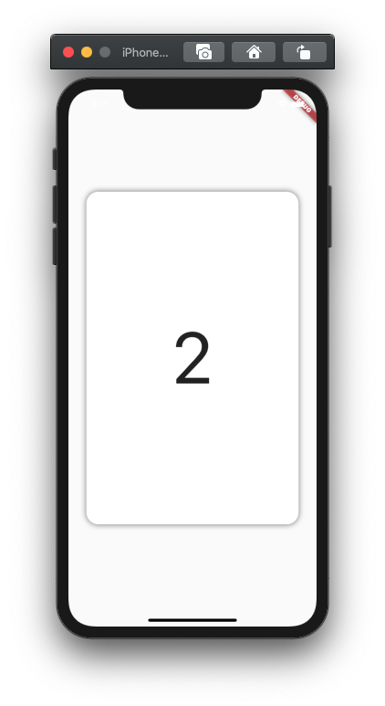

# Scrum Poker

An app that can be used for estimating effort or complexity. The project is based on flutter and makes extensive use of the frameworks animated widgets.

## Core features

- Built in card decs
 - Fibonacci
 - Standard
 - T-Shirt Sizes

- dark Theme
- beautiful animations

  
  

